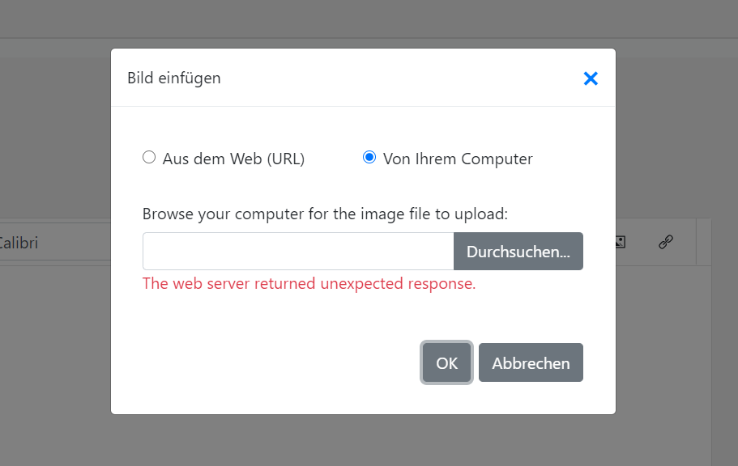

# DXBugImageUploadinRichtextinPageControl

If you change the visibility of a tabpage, uploading a image from your local computer in the Richtext control fails

```
 protected void Page_Load(object sender, EventArgs e)
    {
        // Init

        // If you just set this in the control you got problems by rendering the inner controls

        pageControlV.TabPages[1].Visible = false;
        pageControlV.TabPages[2].Visible = false;

        // If you are allowed to view the second tab switch to true
      if (IsAllowedToWatchOtherTab()) pageControlV.TabPages[2].Visible = true;
    }

    Boolean IsAllowedToWatchOtherTab()
    {
        // Very important code to determine if your allowed ... :)
        //*********************
        //
        // True throws the bug , false not
        //
        return true;

        //return false;
    }

```




#Solution
Set visibility in Page_Init
